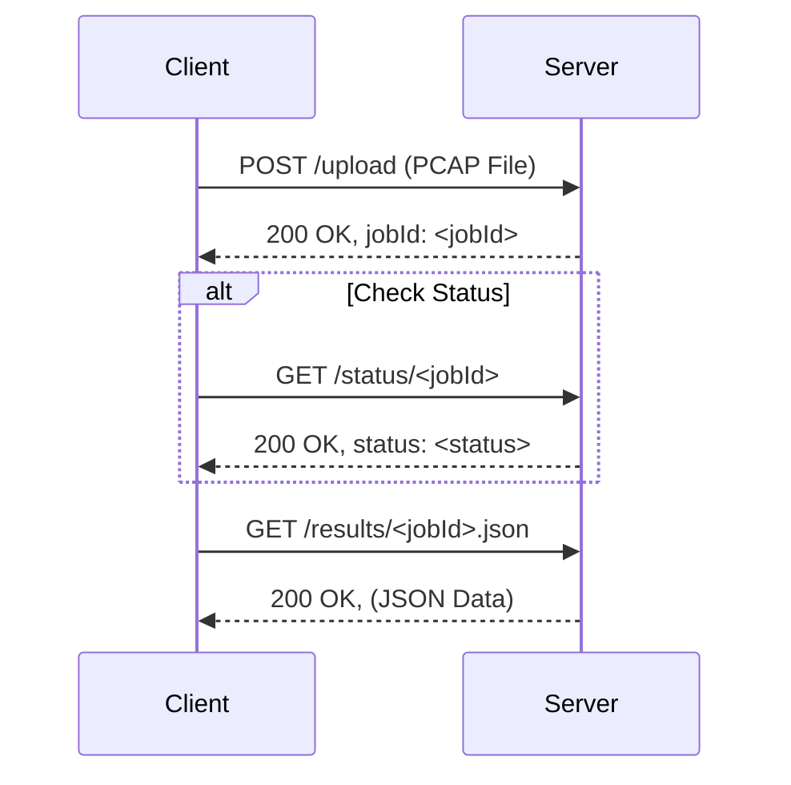

# AWS EC2 Server Setup Guide for PCAP-to-JSON Processor

This guide details the steps to configure an AWS EC2 instance (Ubuntu/Debian-based) to host the Node.js API for PCAP processing and serve the resulting JSON files via Apache over HTTPS.

The node server we will host will allow us to do the following:

*   Upload a PCAP file using the `/upload` endpoint. This returns a `jobId`.
*   Use the `jobId` to download the JSON file at: `https://pcap-results.yourdomain.com/results/JOB_ID.json`
*   Optional: Check the conversion status via the `/status/:jobId` endpoint.

A simple Android app (Kotlin Compose) was built to demonstrate the use of this server. You can find it here: [https://github.com/ganainy/pcap-to-json-with-aws-android-app](https://github.com/ganainy/pcap-to-json-with-aws-android-app)

**Why not implement the functionality directly in the app?**  Offloading PCAP processing to a server is beneficial for several reasons:

*   **Complexity and C code:** PCAP parsing is a complex task that often relies on libraries written in C or C++. Integrating and managing these libraries within an Android (Kotlin/Java) app can be challenging.  Maintaining and ensuring the portability of native code introduces considerable complexity and overhead.
*   **Reduced device load and battery consumption:** Processing PCAP files directly on device can be time and resource-intensive. 

**Prerequisites:**

*   A running AWS EC2 instance (Ubuntu/Debian recommended).
*   SSH access to the instance with `sudo` privileges.
*   The public IP address of the instance.
*   A registered domain name (e.g., `yourdomain.com`).
*   Access to your DNS provider to manage domain records.

---

**Setup Guide:**  
A step-by-step guide to implement this on your AWS server can be found [here](SETUP-GUIDE.md).

