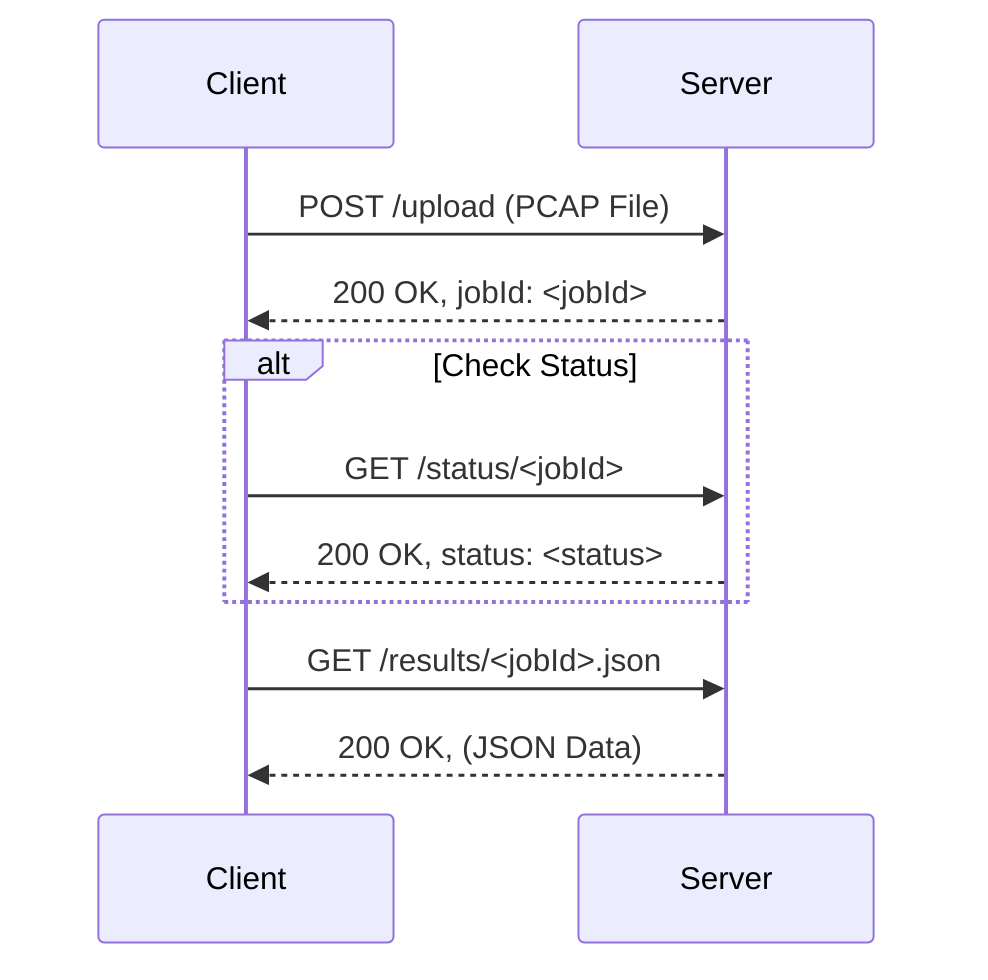

# AWS EC2 Server Setup Guide for PCAP-to-JSON Processor

This guide details the steps to configure an AWS EC2 instance (Ubuntu/Debian-based) to host the Node.js API for PCAP processing and serve the resulting JSON files via Apache over HTTPS.

The node server we will host will allow us to do the following:

*   Upload a PCAP file using the `/upload` endpoint. This returns a `jobId`.
*   Use the `jobId` to download the JSON file at: `https://pcap-results.yourdomain.com/results/JOB_ID.json`
*   Optional: Check the conversion status via the `/status/:jobId` endpoint.



A simple Android app (Kotlin Compose) was built to demonstrate the use of this server. You can find it here: [https://github.com/ganainy/pcap-to-json-with-aws-android-app](https://github.com/ganainy/pcap-to-json-with-aws-android-app)

**Why not implement the functionality directly in the app?**  Offloading PCAP processing to a server is beneficial for several reasons:


*   **Complexity and C code:** PCAP parsing is a complex task that often relies on libraries written in C or C++. Integrating and managing these libraries within an Android (Kotlin/Java) app can be challenging.  Maintaining and ensuring the portability of native code introduces considerable complexity and overhead.
*   **Reduced device load and battery consumption:** Processing PCAP files directly on device can be time and resource-intensive. 

**Prerequisites:**

*   A running AWS EC2 instance (Ubuntu/Debian recommended).
*   SSH access to the instance with `sudo` privileges.
*   The public IP address of the instance.
*   A registered domain name (e.g., `yourdomain.com`).
*   Access to your DNS provider to manage domain records.

---

## Phase 1: Initial Server Setup & Software Installation

1.  **Connect via SSH:**
    ```bash
    ssh -i /path/to/your-key.pem ubuntu@YOUR_SERVER_PUBLIC_IP
    # Replace 'ubuntu' with 'ec2-user' for Amazon Linux/CentOS/RHEL if needed.
    # Replace YOUR_SERVER_PUBLIC_IP.
    ```

2.  **Update System Packages:**
    ```bash
    sudo apt update
    sudo apt upgrade -y
    ```

3.  **Install Core Software:**
    *   **Apache2 (Web Server):**
        ```bash
        sudo apt install apache2 -y
        sudo systemctl start apache2
        sudo systemctl enable apache2 # Ensure it starts on boot
        ```
    *   **Node.js & npm (LTS Version via NodeSource):**
        ```bash
        curl -fsSL https://deb.nodesource.com/setup_lts.x | sudo -E bash -
        sudo apt install nodejs -y
        node -v # Verify Node.js installation
        npm -v  # Verify npm installation
        ```
    *   **tshark (PCAP Processing Tool):**
        ```bash
        sudo apt install tshark -y
        # Answer <Yes> or <No> to non-root capture prompt based on policy (usually <No>).
        tshark --version # Verify installation
        ```
    *   **Certbot (Let's Encrypt SSL Client):**
        ```bash
        sudo apt install certbot python3-certbot-apache -y
        ```

## Phase 2: DNS Configuration

1.  **Create DNS Records:**
    *   Go to your DNS provider.
    *   Create **A records** pointing to your server's public IP (`YOUR_SERVER_PUBLIC_IP`) for:
        *   `yourdomain.com` (if hosting API there) or `api.yourdomain.com` (if using a separate API subdomain).
        *   `pcap-results.yourdomain.com` (subdomain for serving results).
    *   Allow time for DNS propagation (check with `dig` or `nslookup`).

## Phase 3: Apache Configuration

1.  **Enable Apache Modules:**
    ```bash
    sudo a2enmod ssl alias rewrite proxy proxy_http headers # Enable required modules
    sudo systemctl restart apache2
    ```

2.  **Create Directory for Results:**
    *   Create under `/var/www/` for standard web access:
        ```bash
        sudo mkdir /var/www/pcap_results
        # Set owner:group (Node user:Apache group - e.g., ubuntu:www-data)
        sudo chown YOUR_LINUX_USER:APACHE_GROUP /var/www/pcap_results
        # Set permissions (Owner=rwx, Group=rwx, Other=rx)
        sudo chmod 775 /var/www/pcap_results
        ```
        *(Replace `YOUR_LINUX_USER` (e.g., `ubuntu`) and `APACHE_GROUP` (e.g., `www-data`))*

3.  **Configure Apache Virtual Hosts:**
    *   **Disable Default Site (Optional but Recommended):**
        ```bash
        sudo a2dissite 000-default.conf
        ```
    *   **(A) Create/Edit Config for API Proxy (e.g., `yourdomain.com` or `api.yourdomain.com`):**
        *   File: `sudo nano /etc/apache2/sites-available/your-api-domain.conf` (e.g., `yourdomain.com.conf`)
        *   Content:
            ```apache
            # /etc/apache2/sites-available/your-api-domain.conf

            <IfModule mod_ssl.c>
            <VirtualHost *:443>
                ServerName yourdomain.com # Or api.yourdomain.com
                ServerAdmin webmaster@yourdomain.com # Optional

                ErrorLog ${APACHE_LOG_DIR}/api_error.log
                CustomLog ${APACHE_LOG_DIR}/api_access.log combined

                # --- SSL Configuration (Certbot manages these paths later) ---
                SSLEngine on
                # SSLCertificateFile /etc/letsencrypt/live/yourdomain.com/fullchain.pem # Placeholder
                # SSLCertificateKeyFile /etc/letsencrypt/live/yourdomain.com/privkey.pem # Placeholder
                # Include /etc/letsencrypt/options-ssl-apache.conf # Placeholder

                # --- Reverse Proxy for Node.js API (listening on port 3100 internally) ---
                ProxyPreserveHost On
                ProxyRequests Off
                ProxyPass /upload http://localhost:3100/upload
                ProxyPassReverse /upload http://localhost:3100/upload
                ProxyPass /status/ http://localhost:3100/status/
                ProxyPassReverse /status/ http://localhost:3100/status/

            </VirtualHost>
            </IfModule>

            # Optional: Redirect HTTP to HTTPS
            <VirtualHost *:80>
               ServerName yourdomain.com # Or api.yourdomain.com
               Redirect permanent / https://yourdomain.com/ # Or https://api.yourdomain.com/
            </VirtualHost>
            ```
    *   **(B) Create Config for Results Subdomain (`pcap-results.yourdomain.com`):**
        *   File: `sudo nano /etc/apache2/sites-available/pcap-results.yourdomain.com.conf`
        *   Content:
            ```apache
            # /etc/apache2/sites-available/pcap-results.yourdomain.com.conf

            <IfModule mod_ssl.c>
            <VirtualHost *:443>
                ServerName pcap-results.yourdomain.com
                ServerAdmin webmaster@yourdomain.com # Optional

                ErrorLog ${APACHE_LOG_DIR}/pcap-results-error.log
                CustomLog ${APACHE_LOG_DIR}/pcap-results-access.log combined

                # --- SSL Configuration (Certbot manages these paths later) ---
                SSLEngine on
                # SSLCertificateFile /etc/letsencrypt/live/yourdomain.com/fullchain.pem # Placeholder - Certbot might group certs
                # SSLCertificateKeyFile /etc/letsencrypt/live/yourdomain.com/privkey.pem # Placeholder
                # Include /etc/letsencrypt/options-ssl-apache.conf # Placeholder

                # --- Alias for PCAP Results ---
                Alias /results/ "/var/www/pcap_results/"

                # --- Directory Permissions for Results ---
                <Directory "/var/www/pcap_results/">
                    Options Indexes FollowSymLinks # Optional: Remove Indexes to disable browsing
                    AllowOverride None
                    Require all granted
                </Directory>

            </VirtualHost>
            </IfModule>

            # Optional: Redirect HTTP to HTTPS for the subdomain
            <VirtualHost *:80>
               ServerName pcap-results.yourdomain.com
               Redirect permanent / https://pcap-results.yourdomain.com/
            </VirtualHost>
            ```
    *   **Enable New Sites:**
        ```bash
        sudo a2ensite your-api-domain.conf # Use the actual filename
        sudo a2ensite pcap-results.yourdomain.com.conf
        ```
    *   **Test Config & Reload Apache:**
        ```bash
        sudo apache2ctl configtest
        sudo systemctl reload apache2
        ```

## Phase 4: Obtain SSL Certificates

1.  **Run Certbot:**
    *   Obtain/update certificates for *all* domains/subdomains you configured Apache for.
    ```bash
    # Example if using yourdomain.com and pcap-results.yourdomain.com
    sudo certbot --apache --cert-name yourdomain.com -d yourdomain.com -d pcap-results.yourdomain.com
    # Adjust domains (-d flags) as needed for your setup (e.g., if using api.yourdomain.com)
    ```
    *   Follow prompts. Choose the **Redirect** option. Certbot will update the Apache config files with the SSL certificate paths.

2.  **Test Config & Restart Apache:**
    ```bash
    sudo apache2ctl configtest # Should pass without SSL warnings now
    sudo systemctl restart apache2
    ```

## Phase 5: Setup Node.js Application

1.  **Create Project Directory & `cd` into it:**
    ```bash
    # Use a path accessible by your Linux user, e.g., home directory
    mkdir ~/pcap_node_processor
    cd ~/pcap_node_processor
    ```

2.  **Create `server.js`:**
    *   `nano server.js`
    *   Here is an Example Server Code that allows us to do the following:
        *   Upload a PCAP file using the `/upload` endpoint. This returns a `jobId`.
        *   Use the `jobId` to download the JSON file at: `https://pcap-results.yourdomain.com/results/JOB_ID.json`.
        *   Check the conversion status via the `/status/:jobId` endpoint.

        ```javascript
        const express = require('express');
        const multer = require('multer');
        const { v4: uuidv4 } = require('uuid');
        const path = require('path');
        const fs = require('fs');
        const { spawn } = require('child_process'); // For running tshark
        const http = require('http'); // Or https if using SSL

        // --- Configuration ---
        const UPLOAD_DIR = path.join(__dirname, 'uploads');
        const RESULT_DIR = '/var/www/pcap_results';
        const PORT = 3100; // Port the Node.js API will listen on
        // IMPORTANT: This URL MUST match how Apache serves the results folder
        const BASE_RESULT_URL = 'https://pcap-results.ganainy.online/results/';
        // --- In-Memory Job Status (Lost on Restart - Use DB/Redis for Production) ---
        const jobStatus = new Map(); // Use Map for slightly better key management

        // --- Multer Setup for File Uploads ---
        const storage = multer.diskStorage({
            destination: function (req, file, cb) {
                cb(null, UPLOAD_DIR);
            },
            filename: function (req, file, cb) {
                // Use job ID as filename to avoid collisions and link easily
                const jobId = req.jobId; // We'll attach this in the middleware/route
                const ext = path.extname(file.originalname).toLowerCase();
                cb(null, `${jobId}${ext}`); // e.g., aaaaa-bbbb-cccc.pcap
            }
        });

        const fileFilter = (req, file, cb) => {
            const ext = path.extname(file.originalname).toLowerCase();
            if (ext === '.pcap' || ext === '.pcapng') {
                cb(null, true); // Accept file
            } else {
                cb(new Error('Invalid file type. Only .pcap or .pcapng allowed.'), false); // Reject file
            }
        };

        const upload = multer({ storage: storage, fileFilter: fileFilter });

        // --- App Initialization ---
        const app = express();

        // Middleware to generate Job ID before Multer runs
        app.use('/upload', (req, res, next) => {
            req.jobId = uuidv4(); // Attach unique job ID to the request object
            next();
        });

        // --- Helper: Run tshark ---
        function runTsharkConversion(pcapFilePath, jsonFilePath, jobId) {
            console.log(`[Job ${jobId}] Starting tshark conversion for ${pcapFilePath}`);
            jobStatus.set(jobId, { status: 'processing', url: null, error: null });

            const tsharkCommand = 'tshark';
            const args = ['-r', pcapFilePath, '-T', 'json'];

            const process = spawn(tsharkCommand, args);
            const fileStream = fs.createWriteStream(jsonFilePath);

            process.stdout.pipe(fileStream); // Redirect tshark JSON output to file

            let stderrOutput = '';
            process.stderr.on('data', (data) => {
                stderrOutput += data;
                console.error(`[Job ${jobId}] tshark stderr: ${data}`);
            });

            process.on('close', (code) => {
                fileStream.end(); // Ensure file stream is closed
                if (code === 0) {
                    console.log(`[Job ${jobId}] tshark conversion successful.`);
                    const resultUrl = `${BASE_RESULT_URL}${path.basename(jsonFilePath)}`;
                    jobStatus.set(jobId, { status: 'completed', url: resultUrl, error: null });
                } else {
                    console.error(`[Job ${jobId}] tshark exited with code ${code}. Stderr: ${stderrOutput}`);
                    const errorMsg = `tshark error (code ${code})${stderrOutput ? ': ' + stderrOutput.substring(0, 200) + '...' : ''}`;
                    jobStatus.set(jobId, { status: 'failed', url: null, error: errorMsg });
                }
                // Optional: Clean up the uploaded pcap file
                fs.unlink(pcapFilePath, (err) => {
                    if (err) console.error(`[Job ${jobId}] Error removing temp pcap ${pcapFilePath}:`, err);
                    else console.log(`[Job ${jobId}] Removed temp pcap: ${pcapFilePath}`);
                });
            });

            process.on('error', (err) => {
                fileStream.end();
                console.error(`[Job ${jobId}] Failed to start tshark process:`, err);
                jobStatus.set(jobId, { status: 'failed', url: null, error: `Failed to start conversion process: ${err.message}` });
                 // Optional: Cleanup pcap here too if process couldn't start
                fs.unlink(pcapFilePath, (errUnlink) => {/* handle unlink error */});
            });
        }

        // --- API Routes ---

        // POST endpoint for file upload
        app.post('/upload', upload.single('pcap_file'), (req, res) => {
            // upload.single adds 'file' to req if successful
            if (!req.file) {
                // This case might be handled by Multer's error handling already
                return res.status(400).json({ error: 'File upload failed or invalid file type.' });
            }

            const jobId = req.jobId; // Get job ID generated by middleware
            const pcapFilePath = req.file.path;
            const jsonFileName = `${jobId}.json`;
            const jsonFilePath = path.join(RESULT_DIR, jsonFileName);

            console.log(`Received file: ${req.file.originalname}, Job ID: ${jobId}`);

            // Start tshark conversion asynchronously
            runTsharkConversion(pcapFilePath, jsonFilePath, jobId);

            // Respond immediately with Job ID
            res.status(202).json({ job_id: jobId, status: 'processing' });

        }, (error, req, res, next) => {
            // Multer error handler (e.g., invalid file type)
            if (error instanceof multer.MulterError) {
                res.status(400).json({ error: `Multer error: ${error.message}` });
            } else if (error) {
                res.status(400).json({ error: error.message }); // Handle custom errors like file type
            } else {
                next();
            }
        });

        // GET endpoint for status check
        app.get('/status/:jobId', (req, res) => {
            const jobId = req.params.jobId;
            const statusInfo = jobStatus.get(jobId);

            if (statusInfo) {
                res.status(200).json(statusInfo);
            } else {
                res.status(404).json({ status: 'not_found', error: 'Job ID not found' });
            }
        });

        // --- Error Handling Middleware (Basic) ---
        app.use((err, req, res, next) => {
            console.error("Unhandled error:", err.stack);
            res.status(500).send('Something broke!');
        });

        // --- Start Server ---
        const server = http.createServer(app); // Use http

        server.listen(PORT, () => {
            console.log(`PCAP Processor API listening on port ${PORT}`);
            // Ensure directories exist
            if (!fs.existsSync(UPLOAD_DIR)) fs.mkdirSync(UPLOAD_DIR);
            if (!fs.existsSync(RESULT_DIR)) fs.mkdirSync(RESULT_DIR);
        });
        ```

    *   **Verify/update these constants:**
        ```javascript
        // Inside server.js
        const UPLOAD_DIR = path.join(__dirname, 'uploads'); // Relative path within project
        const RESULT_DIR = '/var/www/pcap_results'; // Absolute path for results
        const PORT = 3100; // Port Node.js listens on (matching Apache proxy config)
        const BASE_RESULT_URL = 'https://pcap-results.yourdomain.com/results/'; // HTTPS results URL
        ```
    *   Save and close.

3.  **Create `uploads` Directory (within project dir):**
    ```bash
    mkdir uploads
    ```

4.  **Initialize npm & Install Dependencies:**
    ```bash
    npm init -y
    npm install express multer uuid
    ```

## Phase 6: Set up Process Manager (`pm2`)

1.  **Install pm2 Globally:**
    ```bash
    sudo npm install pm2 -g
    ```

2.  **Start App with pm2:**
    ```bash
    # Ensure you are in ~/pcap_node_processor directory
    pm2 start server.js --name pcap-api
    ```

3.  **Configure pm2 Startup Script:**
    ```bash
    pm2 startup
    # Copy and run the 'sudo env ...' command output by the previous command
    ```

4.  **Save Current pm2 Process List:**
    ```bash
    pm2 save
    ```

5.  **Check Status:**
    ```bash
    pm2 list
    pm2 logs pcap-api # Monitor logs
    ```

## Phase 7: Configure AWS Security Group

1.  Go to the EC2 console -> Instances -> Select your instance -> Security tab -> Click Security Group link.
2.  Edit "Inbound rules".
3.  Ensure rules exist allowing traffic:
    *   **Type:** `SSH`, **Protocol:** `TCP`, **Port Range:** `22`, **Source:** `My IP` (or your specific IP/range).
    *   **Type:** `HTTP`, **Protocol:** `TCP`, **Port Range:** `80`, **Source:** `Anywhere-IPv4` (`0.0.0.0/0`) and `Anywhere-IPv6` (`::/0`). (Needed for Let's Encrypt renewal and redirect).
    *   **Type:** `HTTPS`, **Protocol:** `TCP`, **Port Range:** `443`, **Source:** `Anywhere-IPv4` (`0.0.0.0/0`) and `Anywhere-IPv6` (`::/0`). (Primary access port).
    *   **No need to open port 3100 (or your Node port) publicly** if Apache is correctly configured as a reverse proxy.
4.  Save rules.

## Phase 8: Final Testing

1.  **DNS:** Verify domains/subdomains resolve correctly to your server IP.
2.  **Curl Tests (Use HTTPS):**
    *   `curl -I https://yourdomain.com/` (Or your API domain)
    *   `curl -I https://pcap-results.yourdomain.com/`
    *   `curl -X POST -i -F "pcap_file=@/path/to/test.pcap" https://yourdomain.com/upload`
    *   `curl -i https://yourdomain.com/status/JOB_ID`
    *   `curl -o test_final.json https://pcap-results.yourdomain.com/results/JOB_ID.json`
3.  **Android App:** Ensure the app uses the correct HTTPS URLs (for API calls and downloads) and test the full workflow. Remove any cleartext traffic configurations from the app's manifest and network security config file.

---

## Required Files for GitHub Repository

Based on this setup, the essential files to include in a Git repository would be:

1.  **`~/pcap_node_processor/server.js`**: The core Node.js application code.
2.  **`~/pcap_node_processor/package.json`**: Defines Node dependencies.
3.  **`~/pcap_node_processor/package-lock.json`**: Locks dependency versions.
4.  **`.gitignore`**: To exclude `node_modules`, `uploads`, potentially logs, etc.
    ```gitignore
    # Node
    node_modules/
    npm-debug.log*
    yarn-debug.log*
    yarn-error.log*

    # Server Files (Generated/Uploaded)
    uploads/
    # Optional: Exclude results if you don't want generated JSON in repo
    # results/

    # Logs
    *.log

    # Environment Variables (if any)
    .env

    # OS generated files
    .DS_Store
    Thumbs.db
    ```
5.  **`README.md`**: This setup guide itself (or a modified version).
6.  **Example Apache Configuration Files (Optional but helpful):** Include anonymized copies of your working Apache `.conf` files (e.g., `example-apache-configs/your-api-domain.conf`, `example-apache-configs/pcap-results.yourdomain.com.conf`) as *examples*, indicating where users need to customize paths, domains, etc. **Do NOT commit your actual certificate files (`.pem`)**.

The user setting up the server would clone the repository, run `npm install` inside `~/pcap_node_processor`, and then follow the server setup steps in the README (installing prerequisites, configuring Apache, obtaining certificates, setting up pm2).
